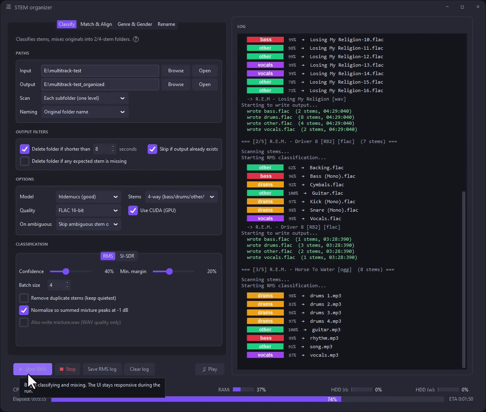

<p align="center">
  
</p>

<div align="center">

# STEM organizer

Organize, classify, and prepare multitrack music datasets.<br>
Automatically create 2- or 4-stems, identify genre/style + vocal gender/reverb, align tracks & auto-rename files.

**By:** Gilliaan & Bas Curtiz  
**Repo:** [github.com/gilliaangilliaan/STEM-organizer](https://github.com/gilliaangilliaan/STEM-organizer)  
**Video:** [How to install & use](https://youtu.be/L-KZmIthER4)

</div>

<p align="center">
  
</p>

## Tabs

| Tab | Role |
|-----|------|
| **Classify** | Demucs classify → group → FLAC/WAV export; optional dedup, normalize, SI-SDR |
| **Match & Align** | Pair acapella/instrumental, organize, align to original |
| **Genre & Gender** | MAEST genre/style; EffNet gender; vocal dry/wet reverb |
| **Rename** | Rule-based sample rename + optional instrument Auto-detect (PaSST) |

Hover **?** in the UI for per-setting help.

## Requirements

- Windows
- Python **3.10** or **3.11** on PATH (for `install-deps.bat` / `build.bat`)
- Disk space for `site-packages\` (Demucs/torch) and optional ML venv under `genre_gender_tagger\`

## Quick start (from source)

```bat
install-deps.bat
python stem_organizer_ui.py
```

`install-deps.bat` installs Demucs + ffmpeg, then optionally Genre & Gender and Rename Auto-detect (shared `genre_gender_tagger\venv`).

## Build `.exe`

```bat
build.bat
```

Then in `dist\`:

```bat
install-deps.bat
STEM-organizer.exe
```

## License

[MIT](LICENSE)
