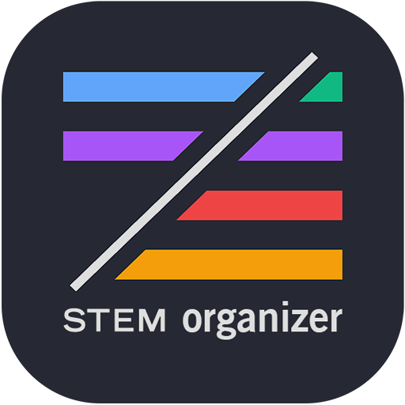
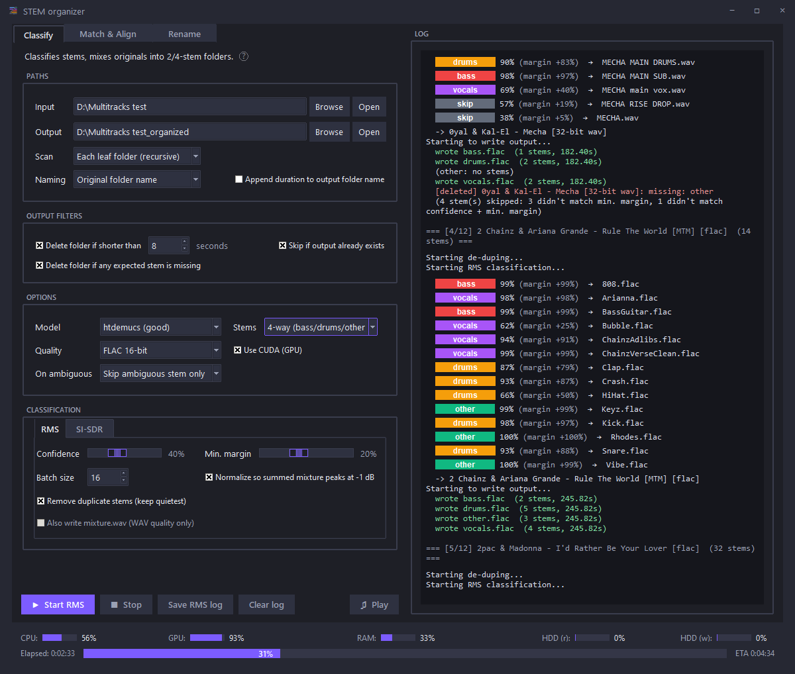

<p align="center">
  
</p>

# STEM organizer

Desktop app for batch-organizing multitracks to stem exports (2-stem/4-stem) based on RMS and SI-SDR classification. Includes a built-in **STEM player**, an integrated **Match & Align** workflow, and a full **Track Renamer** for rule-based sample organization.

**By:** Gilliaan & Bas Curtiz  
**Repository:** [github.com/gilliaangilliaan/STEM-organizer](https://github.com/gilliaangilliaan/STEM-organizer)  
**Video guide:** [How to install & use STEM organizer](https://youtu.be/Zqj6thKYrUs)

<p align="center">
  
</p>

---

## What it does

Point the app at a folder of multitrack exports (one song per subfolder). For each song it:

1. **Classifies** every stem with a Demucs model (RMS energy analysis).
2. **Groups** accepted stems into the chosen output categories.
3. **Writes** FLAC or WAV files to a mirrored output tree.
4. Optionally **deduplicates** near-identical stems, **normalizes** peak level, appends **duration** to folder names, and filters **short** or **incomplete** results.

A second tab runs **SI-SDR** checks on already-organized folders and can recycle stems or whole songs that fall below per-stem thresholds.

### Match & Align (integrated)

Use the **Match & Align** tab in the left panel for the downstream workflow:

1. **Match** — match acapella and instrumental files by ID3/FLAC tags (with filename fallback), then organize into `Artist - Title` folders.
2. **Align** — export a song list, distribute downloaded originals into song folders, sort into `with_original` / `without_original`, and cross-correlate-align instrumental and acapella to the original timeline.
3. **Play** — audition aligned stems in the STEM player (instrumental → acapella → original), with pass/fail folder tagging.

Match & Align settings are stored in the same `settings.json` as the organizer. `install-deps.bat` also installs `mutagen`, `scipy`, and `librosa` for pairing and alignment.

### Track Renamer (integrated)

Use the **Rename** tab to scan sample folders, build ordered filename rules, preview changes, and audition audio with a category-colored waveform. Large folders use a virtualized, background-computed preview.

Selected files are renamed safely with automatic `_1`, `_2`, and subsequent conflict suffixes. After renaming, the app can create `BASS`, `DRUMS`, `VOCALS`, and other prefix folders inside a destination selected by the user and move each renamed file into the matching folder.

Track Renamer presets remain in `~/.track_renamer/presets`. Audio preview uses the `ffmpeg`, `ffprobe`, and `ffplay` executables installed by `install-deps.bat`.

---

## Features

| Area | Details |
|------|---------|
| **Classification** | RMS-based category assignment with configurable confidence (default 40%) and margin (default 20%) |
| **Stem modes** | 2-way instrumental/vocals or 4-way bass/drums/other/vocals |
| **Output formats** | FLAC 16/24-bit, WAV 16/24-bit, WAV 32-bit float |
| **GPU** | CUDA when PyTorch matches your GPU; automatic CPU fallback |
| **Dedup** | Phase-inversion null test; GPU batching on cards with ≥ 8 GiB VRAM |
| **SI-SDR** | Per-stem quality scoring with recycle-bin actions |
| **STEM player** | Multi-track preview with solo/mute, seek, zoom, and Match & Align library review |
| **Match & Align** | Tag-based pairing, folder organize, original distribution, stem alignment |
| **Track Renamer** | Rule stack, lazy preview, audio waveform, conflict-safe rename, prefix-folder organization |
| **Batch tools** | Skip existing, sequential naming + `index.json`, mixture export, min-duration filter |

Hover the **?** tooltips in the UI for detailed explanations of each setting.

---

## Requirements

- **Windows** (primary target; the UI uses a custom title bar on Windows)
- **Python 3.10.x or 3.11.x** (required for `install-deps.bat` and for building from source)
- Enough disk space for `site-packages/` (PyTorch, Demucs, CustomTkinter, psutil) and optional `ffmpeg/`

---

## Quick start (pre-built `.exe`)

1. Download or build `STEM-organizer.exe` into a folder (e.g. `dist/`).
2. Run **`install-deps.bat`** once in that same folder.
   - Choose PyTorch build:
     - **1** — NVIDIA RTX 20/30/40 (CUDA 12.4)
     - **2** — CPU only
     - **3** — NVIDIA RTX 50-series / Blackwell (CUDA 12.8, e.g. 5090)
3. Start **`STEM-organizer.exe`**.

`install-deps.bat` creates `site-packages/` beside the exe, downloads **ffmpeg** into `ffmpeg/`, and writes `python-version.txt` so the installer Python matches the embedded runtime.

> If you have several Python versions installed, run e.g. `py -3.11 install-deps.bat` so it matches the version recorded in `python-version.txt`.

---

## Run from source

```bat
install-deps.bat
python stem_organizer_ui.py
```

Or use the PyInstaller entry point after dependencies are installed:

```bat
python run_stem_organizer.py
```

---

## Build the `.exe` yourself

From the repo root (Python 3.10 or 3.11 on `PATH`):

```bat
build.bat
```

Output:

- `dist\STEM-organizer.exe`
- `dist\install-deps.bat` (copied automatically)
- `dist\python-version.txt`

Run `install-deps.bat` inside `dist\` before launching the exe.

`build.bat` creates a local `.build-venv/`, installs PyInstaller, and bundles via `stem_organizer.spec`. Build artifacts (`build/`, `.build-venv/`) are gitignored.

---

## Typical workflow

1. Set **Input** to the root folder containing one subfolder per song.
2. Set **Output** to where organized stems should be written.
3. Pick **scan mode**, **stem mode**, **model**, and **quality**.
4. Adjust **confidence** / **margin** if needed (defaults: 40% / 20%).
5. Click **▶ Start**.
6. Optional: switch to the **SI-SDR** tab after RMS export, or click **♫ Play** to open the STEM player on a finished folder.

Settings are saved to `settings.json` beside the app (ignored by git).

---

## Project layout

| File | Role |
|------|------|
| `stem_organizer_ui.py` | Main application UI and processing logic |
| `pair_finder_panel.py` | Match & Align UI (Match + Align sub-tabs) |
| `track_renamer_panel.py` | Embedded Track Renamer controller and workspace |
| `track_renamer/` | Track Renamer engine, scanner, audio service, and GUI components |
| `pair_matcher.py` | Acapella/instrumental tag matching and organize |
| `stem_align.py` | Distribute originals, sort folders, cross-correlation align |
| `stem_player.py` | STEM preview player window |
| `restore_align_backups.py` | CLI to restore stems from `_backup_before_align` |
| `run_stem_organizer.py` | Frozen-app entry point |
| `deps_bootstrap.py` | Loads external `site-packages/`; dependency prompts |
| `install-deps.bat` | One-time PyTorch / Demucs / ffmpeg setup |
| `build.bat` | PyInstaller build script |
| `update_checker.py` | GitHub release update check |
| `ffmpeg_bootstrap.py` | Locates bundled or system ffmpeg |

---

## Updates

On startup the app can check [GitHub Releases](https://github.com/gilliaangilliaan/STEM-organizer/releases) for a newer version. The status bar credit line and **About** dialog link to the repository.

---

## License

See the [LICENSE](https://github.com/gilliaangilliaan/STEM-organizer/blob/main/LICENSE) file in the GitHub repository (MIT).
